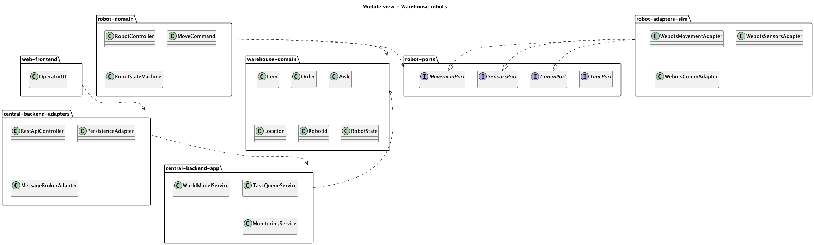
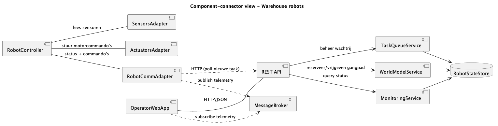
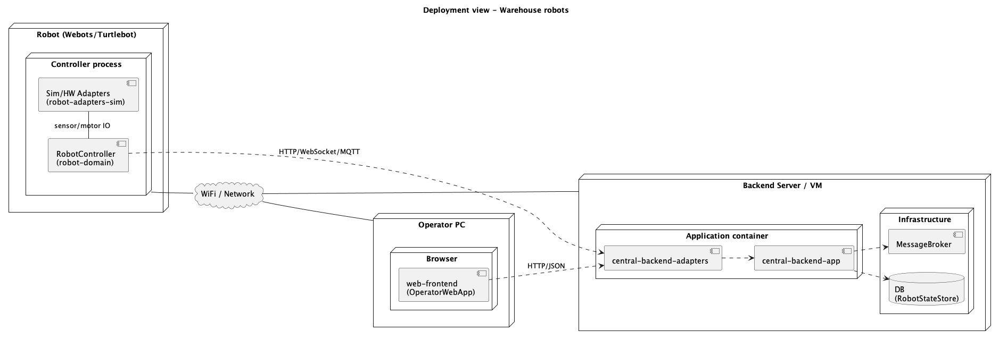
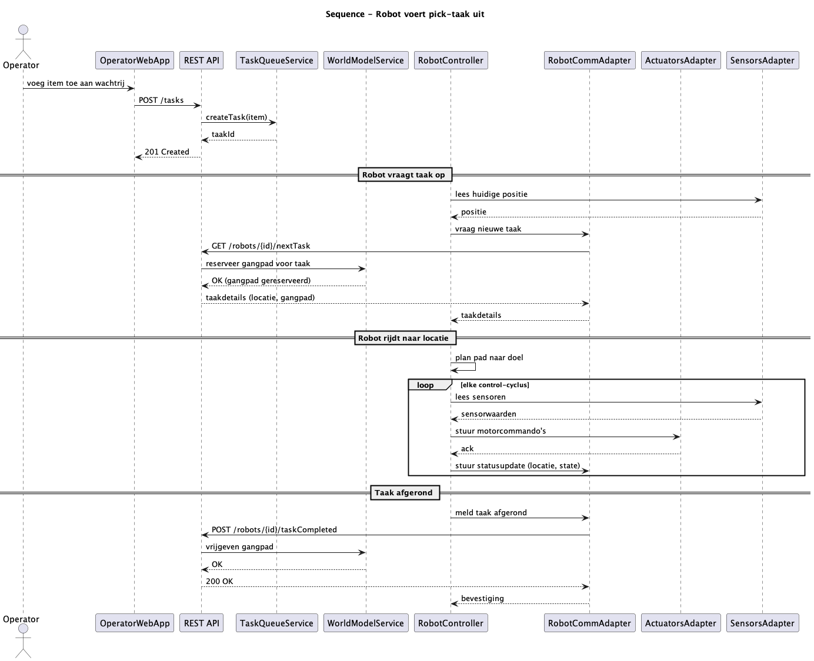

# Warehouse Robots - Architecture Diagrams

This repository contains the architectural diagrams for the **Warehouse Robots** system, developed for the Cyber-Physical Systems course. The diagrams are created using [PlantUML](https://plantuml.com/).

## 1. Module View
The Module View describes the static structure of the system, including the domain models (e.g., Item, Order, Aisle, Location) and their relationships.
* **Source:** [`module_view.puml`](module_view.puml)
* **Diagram:**
  

---

## 2. Component-Connector View
The Component-Connector View illustrates the runtime components of the system (e.g., RobotController, SensorsAdapter, ActuatorsAdapter) and how they communicate with each other.
* **Source:** [`component-connector_view.puml`](component-connector_view.puml)
* **Diagram:**
  

---

## 3. Allocation-Deployment View
The Deployment View shows how the software components are mapped to the physical hardware nodes (e.g., Robot Webots/Turtlebot, Server).
* **Source:** [`allocation-deployment_view.puml`](allocation-deployment_view.puml)
* **Diagram:**
  

---

## 4. Behavioural View
The Behavioural View provides a sequence diagram detailing the interactions when a robot executes a pick task, involving the Operator, WebApp, REST API, TaskQueueService, and the RobotController.
* **Source:** [`behaviour.puml`](behaviour.puml)
* **Diagram:**
  

---

